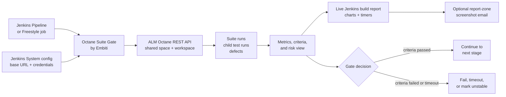
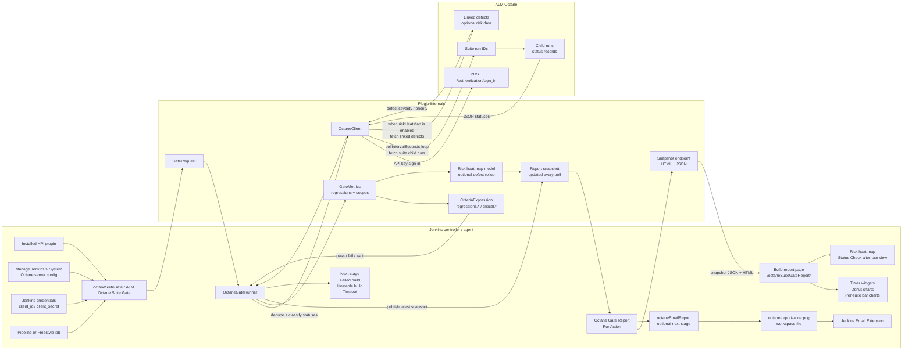
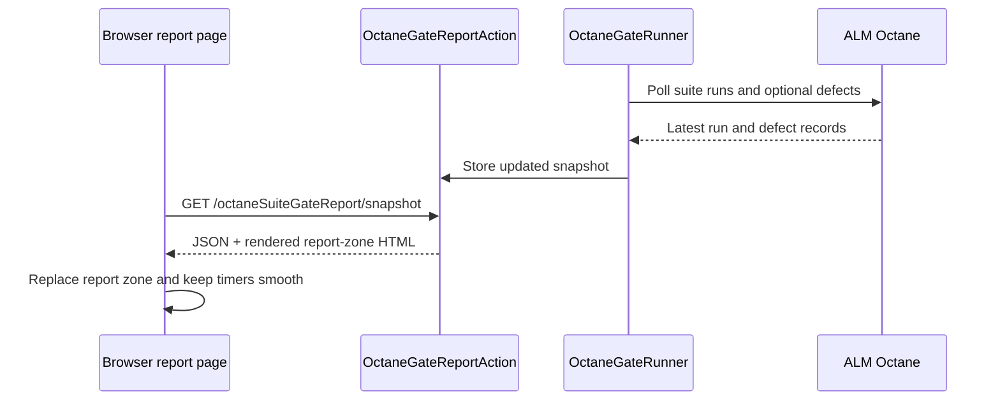
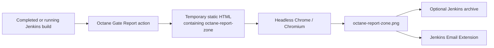

# Architecture

This document describes how **Octane Suite Gate by Embiti** is designed once the
plugin is installed into Jenkins.

## High-Level Flow



In simple terms, Jenkins gives the plugin an Octane server, workspace, suite run
IDs, and criteria. The plugin polls Octane, computes the latest quality metrics,
updates a live build report, and either allows the pipeline to continue or stops
the build according to the configured gate behavior.

## System View



The plugin is a gate, not a test trigger. It waits for suite runs that already
exist in ALM Octane and decides whether Jenkins may continue.

## Jenkins Installation

The plugin is packaged as an HPI file:

```text
target/octane-suite-gate-by-embiti.hpi
```

After installation, Jenkins discovers the plugin extensions through Jenkins
annotations:

- `configs.OctaneSuiteGateConfiguration`: global Jenkins configuration section.
- `configs.OctaneServer`: repeatable Octane server configuration entries.
- `controllers.OctaneSuiteGateStep`: Pipeline step named `octaneSuiteGate`.
- `controllers.OctaneEmailReportStep`: Pipeline step named `octaneEmailReport`.
- `controllers.OctaneSuiteGateBuilder`: Freestyle build step named `ALM Octane Suite Gate`.
- `models.OctaneGateScope`: nested scope object named `octaneGateScope`.

The Java sources are organized under the base package into focused folders:

- `actions`: per-build Jenkins report actions and chart pages.
- `configs`: global Jenkins configuration and Octane server definitions.
- `controllers`: Pipeline and Freestyle entry points.
- `entities`: ALM Octane API record shapes.
- `listeners`: Jenkins build-log output helpers.
- `models`: gate request, result, metrics, scope, and status models.
- `repositories`: low-level ALM Octane REST API access.
- `services`: gate orchestration and criteria evaluation.
- `utils`: shared string and parsing helpers.

## Configuration Model

Administrators configure Octane servers in:

```text
Manage Jenkins > System > Octane Suite Gate by Embiti
```

Each server entry contains:

- `serverId`: logical name used by jobs, such as `octane-prod`.
- `baseUrl`: Octane host root, such as `https://octane.example.com`.
- `credentialsId`: Jenkins username/password credential ID.

The Jenkins credential maps to Octane API key authentication:

- Jenkins username: Octane `client_id`.
- Jenkins password: Octane `client_secret`.

The server form exposes one validation action:

- **Test Base URL**: performs a basic HTTP reachability check against `baseUrl`.

The shared space and workspace are supplied by each Pipeline/Freestyle job because
suite runs are workspace-scoped in ALM Octane.

## Workspace Selection Flow

Octane server configuration is intentionally small:

```text
serverId + baseUrl + credentialsId
```

The shared space and workspace are job inputs:

```text
sharedSpaceId + workspaceId
```

This avoids ambiguous routing when one Jenkins controller talks to several
Octane workspaces. A suite run ID is only meaningful inside a specific shared
space and workspace, so the plugin uses the Jenkinsfile values directly instead
of trying every configured workspace behind the same `serverId`.

If a suite run cannot be found in the supplied shared space/workspace, the plugin
fails with a user-facing message that points to the likely configuration problem:

```text
Suite run 454472 was not found in shared space 10027, workspace 4004.
Check sharedSpaceId, workspaceId, and suite run IDs in the Jenkinsfile.
```

Low-level Octane HTTP details remain useful for diagnostics, but the gate should
surface workspace mismatch errors in language that makes sense to build users.

## Job Entry Points

### Pipeline

Pipeline jobs call:

```groovy
octaneSuiteGate(
  serverId: 'octane-prod',
  sharedSpaceId: '1001',
  workspaceId: '2002',
  suiteRunId: '1196,1200',
  criteria: 'regressions.executionRate == 100 AND regressions.passRate >= 95',
  pollIntervalSeconds: 30,
  timeoutMinutes: 120,
  timeoutMinutesExtended: 0,
  markUnstable: false,
  riskHeatMap: true
)
```

`suiteRunId` accepts either a single ID or a comma/space-separated list. Multiple
suite runs are aggregated into one regression metrics set.
`sharedSpaceId` and `workspaceId` are required job-level values because suite runs
are scoped to an ALM Octane workspace.

### Freestyle

Freestyle jobs use the build step:

```text
ALM Octane Suite Gate
```

The Freestyle builder delegates to the same runtime request model used by the
Pipeline step, so both entry points share the same gate behavior.

### Optional Email Step

Pipeline jobs may add a later notification stage:

```groovy
octaneEmailReport(
  to: 'qa-team@example.com',
  subject: "Octane Gate Report - ${env.JOB_NAME} #${env.BUILD_NUMBER}",
  body: 'Attached is the Octane report-zone screenshot.',
  onFailure: 'UNSTABLE'
)
```

This step reads the current build's `Octane Gate Report`, captures only
`octane-report-zone`, and sends it through Jenkins Email Extension. It is
Pipeline-only and does not change gate criteria or build result unless the email
step itself fails according to `onFailure`.

## Runtime Flow

1. Jenkins reaches the `octaneSuiteGate` Pipeline step or Freestyle build step.
2. The step creates a `GateRequest`.
3. `OctaneGateRunner` resolves the configured `OctaneServer` by `serverId`.
4. The request supplies `sharedSpaceId` and `workspaceId` from the job.
5. The runner resolves Jenkins credentials by `credentialsId`.
6. The runner creates `OctaneClient` and signs in to Octane.
7. The step attaches an `Octane Gate Report` action to the current build.
8. The runner polls until the gate passes, fails, or times out.
9. Each poll fetches suite child runs, computes metrics, and updates the report snapshot.
10. Optional scopes fetch either separate suite-run child runs or filtered child-run subsets.
11. When `riskHeatMap` is enabled, linked defects are fetched and rolled into the risk map.
12. `CriteriaExpression` evaluates the criteria against regression and scoped metrics.
13. Before the step exits, the runner publishes a final snapshot so the dashboard reflects
    the latest pass/fail/timeout state without waiting for another poll interval.
14. Jenkins continues on pass, fails on terminal gate failure, or marks unstable
    when `markUnstable` is enabled.

## Build Report

Every Pipeline and Freestyle run gets a build-side **Octane Gate Report** at:

```text
<build-url>/octaneSuiteGateReport/
```

The report is backed by a persisted Jenkins `RunAction`. It is attached before
polling starts, updated after every poll, and left on the build after pass,
failure, unstable, timeout, or unexpected error.

The report contains chart cards for regression suite runs and each scope. Cards are
resizable and can be reordered by dragging. Two cards fit per row by default;
when one card is resized wide enough, the neighboring card wraps below. The
report also shows two centered countdown donut cards: Testing Time Remaining
from `timeoutMinutes`, and Status Check from `pollIntervalSeconds`. Timer
ring movement uses browser animation frames for smooth millisecond-based motion,
while the center text remains rounded to minutes or seconds. Timer SVGs render at
a higher internal resolution with geometric precision hints and a subtle progress
halo to reduce jagged circular edges. Each section renders:

- a donut chart for total Passed, Failed, Blocked, Skipped, and Running counts.
- a vertical bar chart for the same counts per suite run, with bar height
  scaled against the suite run with the most tests in that section.

The chart colors are fixed:

- Passed: `#009900`
- Failed: `#990000`
- Blocked: `#631919`
- Skipped: `#ffb74d`
- Running: `#808080`

## Live Report Refresh Flow

The build report updates without reloading the whole Jenkins page.



The Status Check timer counts down from `pollIntervalSeconds`. When it reaches
zero, the browser enters an updating phase and checks the snapshot endpoint every
500ms until it sees a newer `updatedAt` value. The charts and execution progress
then update in place. This makes the UI communicate Octane/Jenkins refresh
overhead without changing the backend polling interval.

The report keeps user interaction state during refresh:

- expanded chart cards remain expanded when possible.
- focused timer/report sections remain focused until Escape or backdrop click.
- the active Status Check face, timer or heat map, is preserved.
- vertical bar hover popups are restored from stable bar keys after the DOM is
  replaced.

When execution reaches 100% or the gate times out, the report auto-flips the
Status Check card to the heat-map face if `riskHeatMap` is enabled.

## Status Check And Risk Heat Map

`Status Check` is a two-face card when `riskHeatMap: true`:

- timer face: polling countdown, update status, and smooth progress ring.
- heat-map face: project risk sunburst built from suite runs, run-by users,
  test cases, and linked defects.

The heat map is visual-only. It does not change criteria evaluation, pass/fail
behavior, or `markUnstable`.

Heat map hierarchy:

```text
Project / Workspace
  -> Suite Run
    -> Run By
      -> Test Case
        -> Defect
```

Risk comes from run status and defect severity/priority:

- failed runs start at risk `78`.
- blocked runs start at risk `72`.
- running runs start at risk `20`.
- skipped/neutral runs start at risk `12`.
- passed runs start at risk `0`.
- critical/blocker/urgent defects score `95`.
- very high/high defects score `80`.
- medium/major defects score `58`.
- low/minor defects score `35`.
- unknown severity/priority defects score `45`.

Each node takes the highest direct signal from its own statuses and linked
defects. Parent nodes roll up children using the stronger of weighted average
risk or 75% of the highest child risk, so one dangerous branch remains visible
without letting a large number of healthy tests completely hide it.

Critical suite membership does not currently add an extra multiplier; risk is
driven by actual failed/blocked/running state and defect severity data.

Risk colors:

- low `0-20`: green
- moderate/unknown `21-45`: blue
- warning `46-70`: yellow
- high `71-100`: red

The number in the middle of the heat map is the rolled-up project risk score for
the current gate snapshot, on a 0-100 scale. Larger red or yellow branches show
where risk is concentrated.

## Bar Popup Flow

Per-run-by vertical bars expose a lightweight hover popup. The popup is a single
page-level overlay outside `octane-report-zone`, so it is not destroyed when the
report HTML is refreshed.

The flow is:

1. Each bar column renders stable `data-card-key` and `data-bar-key` values.
2. Hovering a bar copies that bar's hidden popup HTML into the persistent overlay.
3. During snapshot replacement, the overlay remains visible.
4. After replacement, JavaScript finds the matching new bar and copies updated
   popup content into the overlay before the browser paints.
5. If the bar no longer exists, the popup closes cleanly.

The popup border reflects the bar's dominant status. The dominant status is the
largest non-zero status count in the bar. Ties resolve by operational risk:

```text
Failed > Blocked > Running > Skipped > Passed
```

This keeps the popup focused on the most important status when a bar is mixed.

## Email Screenshot Flow

`octaneEmailReport` is a post-gate Pipeline helper:



Generated email files live under:

```text
$WORKSPACE/.octane-suite-gate/report-email/
```

The screenshot captures `octane-report-zone` only. Timer-zone controls and the
Status Check heat map are intentionally outside the email screenshot so the email
focuses on the final report charts. Email failure behavior is controlled by:

- `onFailure: 'UNSTABLE'`
- `onFailure: 'FAILURE'`
- `onFailure: 'WARN'`

## Octane API Flow

Authentication:

```text
POST {baseUrl}/authentication/sign_in
```

The request sends `client_id` and `client_secret`. The client remembers Octane
cookies, including `LWSSO_COOKIE_KEY`, and sends them on later API calls.

Suite run lookup:

```text
GET /api/shared_spaces/{space}/workspaces/{workspace}/runs?query="id EQ {suiteRunId}"&fields=...&limit=1
```

If the aggregate runs query is rejected or does not return a suite run, the
client falls back to:

```text
GET /api/shared_spaces/{space}/workspaces/{workspace}/suite_runs/{suiteRunId}?fields=...
```

The client sends:

```text
ALM-OCTANE-TECH-PREVIEW: true
Accept: application/json
```

Child run lookup:

```text
GET /api/shared_spaces/{space}/workspaces/{workspace}/runs?query="id EQ 101||id EQ 102"&fields=...&limit=200&offset=0
```

Scoped child run lookup:

```text
GET /api/shared_spaces/{space}/workspaces/{workspace}/runs
  ?query="(id EQ 101||id EQ 102);(test={((product_areas={id=1004||id=1005}))})"
  &fields=...
  &limit=200
  &offset=0
```

Linked defect lookup for the risk heat map:

```text
GET /api/shared_spaces/{space}/workspaces/{workspace}/defects
  ?query="test EQ {id EQ 101}||run EQ {id EQ 101}||detected_in_run EQ {id EQ 101}"
  &fields=...
  &limit=200
  &offset=0
```

The client queries by supported relationships (`test`, `run`, and
`detected_in_run`) and deduplicates defects by ID. If an Octane version does not
support one relationship field, that relationship is ignored and the client keeps
any defects found through the other supported fields. `riskHeatMapDefectQuery`
is appended to the defect query when supplied, and `riskHeatMapMaxDefects` caps
the number of defect records loaded per poll.

Sign out is best effort:

```text
POST {baseUrl}/authentication/sign_out
```

## Metrics Model

The plugin converts Octane run records into `GateMetrics`:

- `total`
- `executed`
- `passed`
- `failed`
- `skipped`
- `running`
- `executionRate`
- `passRate`
- `failRate`

`executionRate` is:

```text
executed / total * 100
```

`passRate` is:

```text
passed / executed * 100
```

`failRate` is:

```text
failed / executed * 100
```

Zero-run rates evaluate to `0.0`.

## Suite Run Aggregation

When `suiteRunId` contains multiple IDs, for example:

```text
1196,1200
```

the plugin:

1. Splits the value on commas or whitespace.
2. Fetches child runs for each suite run.
3. Deduplicates child runs by run ID.
4. Computes one regression `GateMetrics` object from the combined child runs.
5. Keeps the child-run status list grouped by the original suite run ID for
   build-log and Pipeline-result diagnostics.

The Pipeline return map includes both:

- `suiteRunId`: original string value.
- `suiteRunIds`: parsed list of suite run IDs.

## Scopes

Scopes are named metric buckets. A scope can be backed by its own suite run IDs
or by an Octane query fragment applied to the regression child-run set.

Example:

```groovy
octaneGateScope(
  name: 'critical',
  suiteRunId: '450303,450204'
)
```

For this scope, the plugin fetches child runs for suite runs `450303` and
`450204`. The matching child runs are combined into one metrics bucket named
`critical`.

Scoped suite run IDs and child statuses are tracked separately from the regression
suite-run metrics. If a suite run ID appears in both the regression `suiteRunId`
input and a `critical` scoped `suiteRunId`, the critical scope owns that ID for
criteria and report calculations. It is counted in the critical bucket and excluded
from the regression bucket.

Criteria references the bucket by name:

```text
critical.passRate == 100
```

This expression evaluates the combined `critical` metrics. The criteria
expression controls whether critical metrics override or combine with regression
metrics. With `OR`, either side can pass the gate; with `AND`, both sides must
pass.

Query-backed scopes remain supported for compatibility:

```groovy
octaneGateScope(
  name: 'legacyArea',
  query: 'test={((product_areas={id=1004}))}'
)
```

Query-backed scopes are applied to the combined regression child-run set.

## Criteria Engine

The criteria parser supports:

- `AND`, `OR`
- parentheses
- `==`, `!=`, `>`, `>=`, `<`, `<=`
- regression metrics, such as `regressions.passRate >= 95`
- scoped metrics, such as `critical.passRate == 100`
- shorthand thresholds, such as `100% execution` and `95% pass`

Default criteria:

```text
100% execution AND 100% pass
```

Criteria are evaluated on every poll. With the default `timeoutMinutesExtended: 0`,
the gate passes as soon as the expression evaluates to true. When
`timeoutMinutesExtended` is greater than zero, the gate keeps polling after the
primary timeout and only exits when the extended window depletes or the operator
uses **Exit Octane and Continue**. That manual exit still evaluates the latest
Octane data against the configured criteria.

Unqualified regression metrics and shorthand expressions remain supported for
backward compatibility, but new Jenkinsfiles should prefer `regressions.executionRate`
and `regressions.passRate` for readability.

## Terminal, Timeout, And Build Result Behavior

The plugin keeps polling while relevant runs are still running and the criteria
are false.

The gate fails when:

- all relevant regression and scoped runs are terminal, and
- the criteria still evaluate to false.

The gate times out when:

- `timeoutMinutes` is reached before pass or terminal failure.

When `timeoutMinutesExtended` is greater than zero, primary timeout starts an
`Extended time` report state instead of immediately ending the step. During that
state, execution reaching `100%` does not advance the Pipeline. Finalization
happens only when the extended window expires or **Exit Octane and Continue** is
clicked, then the latest data is judged by the same criteria and `markUnstable`
rules.

When `markUnstable` is false, gate failure stops the build. When `markUnstable`
is true, the build result is set to `UNSTABLE` and the step returns the latest
gate result map.

## Pipeline Result Map

On success, and on unstable gate failure when `markUnstable` is true, Pipeline
receives a map shaped like:

```groovy
[
  suiteRunId: '1196,1200',
  suiteRunIds: ['1196', '1200'],
  criteria: 'regressions.executionRate == 100 AND regressions.passRate >= 95',
  passed: true,
  terminal: true,
  polledAt: '2026-05-13T00:00:00Z',
  metrics: [
    total: 10,
    executed: 10,
    passed: 10,
    failed: 0,
    skipped: 0,
    running: 0,
    executionRate: 100.0,
    passRate: 100.0,
    failRate: 0.0
  ],
  regressions: [
    total: 10,
    executed: 10,
    passed: 10,
    failed: 0,
    skipped: 0,
    running: 0,
    executionRate: 100.0,
    passRate: 100.0,
    failRate: 0.0
  ],
  scopes: [
    critical: [
      total: 4,
      executed: 4,
      passed: 4,
      failed: 0,
      skipped: 0,
      running: 0,
      executionRate: 100.0,
      passRate: 100.0,
      failRate: 0.0
    ]
  ],
  scopeDetails: [
    critical: [
      name: 'critical',
      query: '',
      queryIds: [],
      suiteRunId: '450303,450204',
      suiteRunIds: ['450303', '450204'],
      runIds: ['101', '102', '103', '104'],
      metrics: [
        total: 4,
        executed: 4,
        passed: 4,
        failed: 0,
        skipped: 0,
        running: 0,
        executionRate: 100.0,
        passRate: 100.0,
        failRate: 0.0
      ],
      runs: [
        [id: '101', name: 'critical api', status: 'passed']
      ],
      suiteRuns: [
        '450303': [
          [id: '101', name: 'critical api', status: 'passed']
        ],
        '450204': [
          [id: '104', name: 'critical ui', status: 'passed']
        ]
      ]
    ]
  ],
  suiteRuns: [
    '1196': [
      [id: '101', name: 'critical api', status: 'passed']
    ],
    '1200': [
      [id: '104', name: 'critical ui', status: 'passed']
    ]
  ]
]
```

When enabled, the result map also includes `riskHeatMap`, with summary values
such as `enabled`, `available`, `riskScore`, `fetchedDefectCount`,
`linkedDefectCount`, and `unlinkedOpenDefectCount`.

## Security

The plugin never logs the Octane client secret. Credentials are resolved through
Jenkins Credentials APIs and used only to authenticate against Octane.

Connectivity validation and credential listing require Jenkins administrator
permission.

HTTP failure messages include request URI, status code, and a bounded response
body to help diagnose schema, workspace, and suite-run errors. Request bodies
containing API secrets are not logged.

## Key Classes

| Class | Responsibility |
| --- | --- |
| `actions.OctaneGateReportAction` | Per-build chart report and live snapshot holder. |
| `configs.OctaneSuiteGateConfiguration` | Jenkins global configuration root. |
| `configs.OctaneServer` | One configured Octane server and its validation endpoints. |
| `controllers.OctaneSuiteGateStep` | Pipeline `octaneSuiteGate` step. |
| `controllers.OctaneEmailReportStep` | Pipeline `octaneEmailReport` screenshot email step. |
| `controllers.OctaneSuiteGateBuilder` | Freestyle `ALM Octane Suite Gate` build step. |
| `models.GateRequest` | Runtime request created from Pipeline/Freestyle inputs. |
| `services.OctaneGateRunner` | Main gate loop, polling, metrics, criteria, and build decision. |
| `repositories.OctaneClient` | Low-level authenticated Octane REST client. |
| `models.GateMetrics` | Regression or scoped computed run metrics. |
| `models.GateScopeResult` | Scoped suite/query source, matched run statuses, and scoped metrics. |
| `models.MetricsContext` | Resolves regression and scoped metrics during criteria evaluation. |
| `services.CriteriaExpression` | Safe criteria parser and evaluator. |
| `models.GateResult` | Pipeline result map model. |
| `models.OctaneGateScope` | Named scoped suite-run or query model. |
| `models.OctaneGateReportSnapshot` | Report sections, pie data, and bar data for the build page. |
| `models.OctaneRiskHeatMapBuilder` | Builds defect risk hierarchy and risk scores. |
| `services.OctaneRiskHeatMapRenderer` | Renders heat-map SVG/HTML for the Status Check card. |
| `services.HeadlessBrowserReportScreenshotService` | Captures `octane-report-zone` with Chrome/Chromium. |
| `services.EmailExtensionOctaneReportSender` | Sends the screenshot through Jenkins Email Extension. |

## Examples

- `examples/Jenkinsfile`: regression and critical suite-run gate with optional heat map.
- `examples/Jenkinsfile2`: regression-only gate, also showing the workspace/job-level setup.

## Verification

The test suite covers:

- criteria parsing and scoped metrics
- ID-list parsing
- Octane authentication and cookies
- workspace probing
- suite-run fallback endpoint behavior
- multi-ID scoped query forwarding
- suite-run-backed scoped metrics
- Octane Gate Report chart snapshots and Jenkins build-page rendering
- live snapshot refresh behavior
- persistent bar popups and dominant-status popup coloring
- risk heat-map hierarchy, scoring, and rendering
- optional `octaneEmailReport` failure handling
- Pipeline result map shape

Run:

```bash
mvn spotless:check test
```
